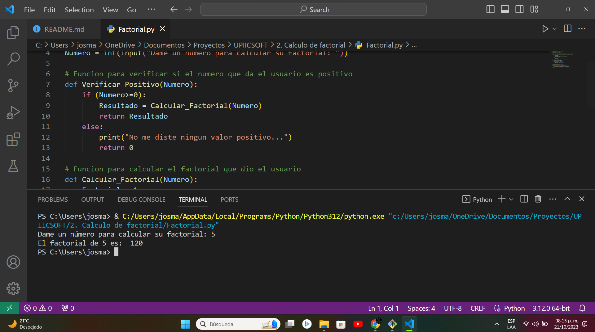

# Presentación

El siguiente repositorio alberga **una colección de ejercicios propuestos** por la comunidad **UPIICSOFT,** la cual forma parte de UPIICSA del Instituto Politécnico Nacional (IPN). Este repositorio incluirá una variedad de ejercicios que serán realizados de forma individual.

<h1 align="center"> Portafolio de evidencias UPIICSOFT </h1>

 Comunidad UPIICSOFT 

# Tabla de contenidos:

---

- [Badges](#badges)
- [Capturas de pantalla](#capturas-de-pantalla)
- [Descripción del proyecto](#descripción-del-proyecto)
- [Herramientas utilizadas](#herramientas-utilizadas)
- [Guía de instalación](#guía-de-instalación)
- [Autor](#autores)
- [Información adicional](#información-adicional)

# Badges

---

- Estado del Proyecto: 
- Versión Actual: 
- Uso de dependencias: 
- Tipo de proyecto: 
- Categoría del proyecto: 

# Capturas de pantalla

---

Las capturas de pantalla que verás a continuación son las más destacadas de los ejercicios realizados en el seno de la comunidad UPIICSOFT.

## Capturas de pantalla del programa de cálculo factorial

# Descripción del proyecto

---

Este repositorio alberga una valiosa colección de ejercicios propuestos por la activa comunidad de UPIICSOFT, perteneciente a la prestigiosa UPIICSA, que forma parte del Instituto Politécnico Nacional (IPN). En este espacio, encontrarás una amplia gama de desafíos que se abordarán individualmente, contribuyendo así al enriquecimiento de habilidades y conocimientos en el ámbito tecnológico.

# Herramientas utilizadas

---

- [Visual Studio Code](https://code.visualstudio.com/)
- [Python](https://www.python.org/)
- [ColorCode](https://htmlcolorcodes.com/es/)
- [Shields.io](https://shields.io/badges/static-badge)

# Guía de instalación

---

¡Bienvenido al repositorio de portafolio de evidencias de la comunidad UPIICSOFT! A continuación, te proporcionaremos una detallada guía paso a paso que te permitirá descargar y configurar la mayoría de nuestros proyectos.

1. **Descargar el Repositorio:**

   - Ve al repositorio en GitHub: https://github.com/Josmar360/UPIICSOFT
   - Haz clic en el botón verde "Code" y selecciona "Download ZIP".
   - Descomprime el archivo ZIP en la ubicación de tu elección.

# Autor/es

---

[Josmar Gustavo Palomino Castelan](https://linktr.ee/josmar360)

# Información adicional

---

El propósito fundamental de este repositorio es llevar a cabo los desafíos planteados por la comunidad de UPIISOFT con el fin de construir un sólido portafolio de evidencias. Este portafolio se irá desarrollando a medida que se aborden cuestiones relacionadas con la programación en Python, la gestión de bases de datos y el análisis de datos. Cada problema o ejercicio abordado en estas áreas contribuirá al enriquecimiento de este conjunto de pruebas y logros.

- [Regresar al inicio](#presentación)
